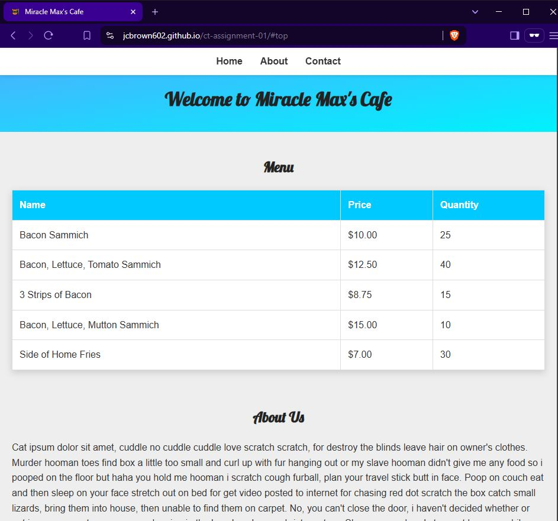
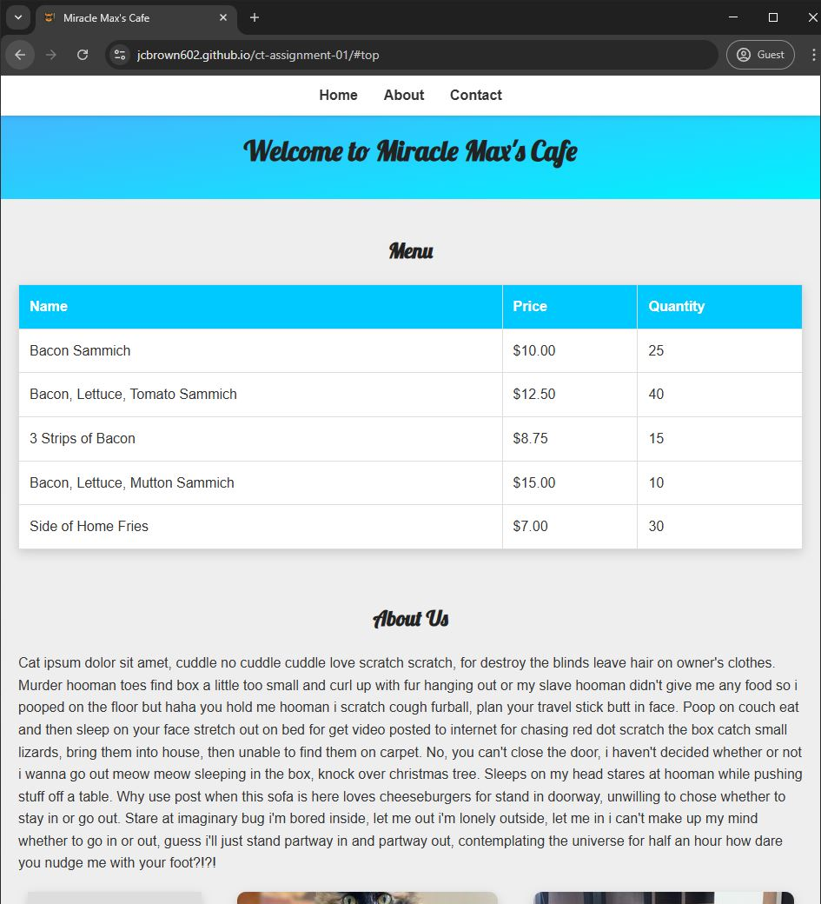
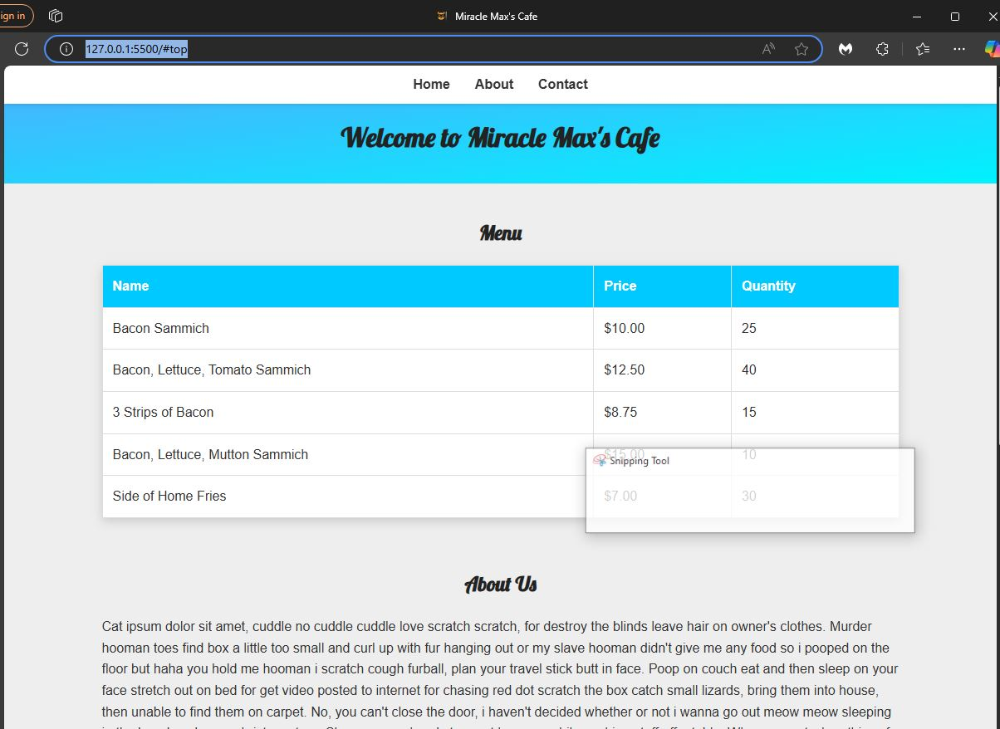
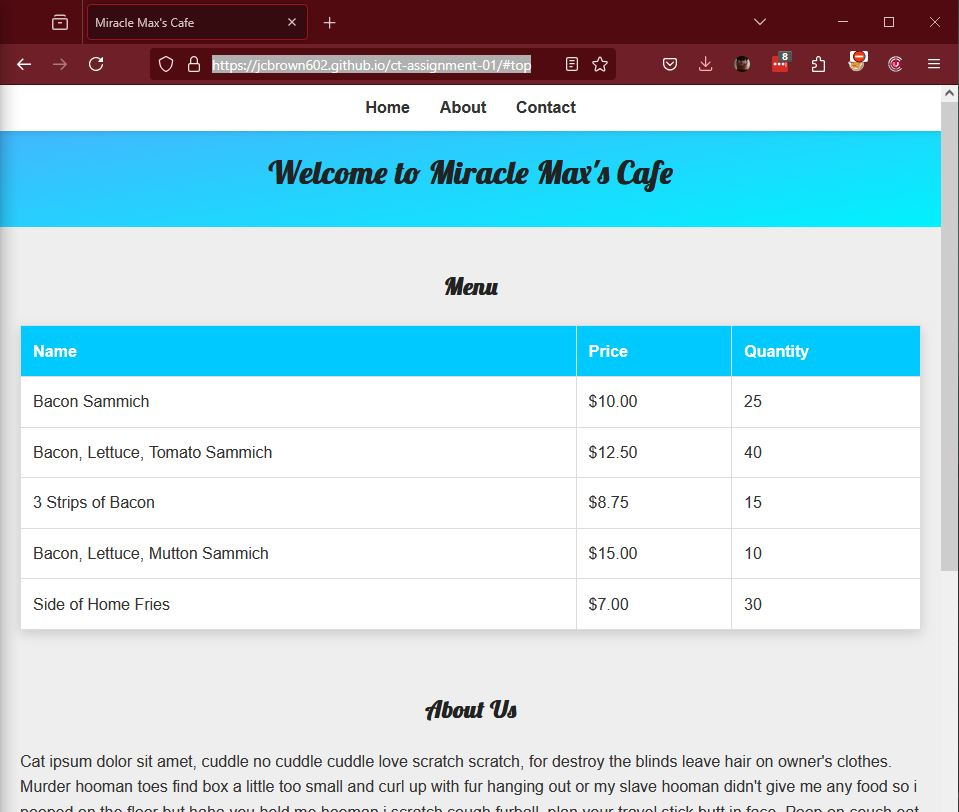

# 🐱 CT Assignment 01 – HTML & CSS Web Page ⚔️


[](https://jcbrown602.github.io/ct-assignment-01/#top)
[](https://github.com/JCBrown602/pirate-kitty-badges)

A clean, simple, responsive web page project featuring a product table, about section, contact form, and a custom favicon that was a result of the emergent cat and pirate themes. 
Created for Coding Temple HTML assignment.

---

## 📸 Preview

### Live site:  
🔗 [https://jcbrown602.github.io/ct-assignment-01/](https://jcbrown602.github.io/ct-assignment-01/)

### Browser Screenshots
Brave
<br/><br/>
Chrome
<br/><br/>
Edge
<br/><br/>
Firefox
<br/><br/>

### Form Submitted Modal

I included a modal feedback message to inform the user something happened to their form.
<br/><br/>

---

## 🚀 Features

- Sticky navigation bar with internal anchor links
- Product table with headers and sample items
- About section with placeholder images, rounded corners, and Lorem/Cat Ipsum text
- Contact form with name, email, message, and referral source (radio buttons)
- Modal "Thank You" confirmation on form submission
- Custom favicon featuring a masked pirate kitty 🐱‍👤
- Responsive, mobile-friendly layout
- Google Fonts (Lobster for headings)

---

## 💾 Setup & Run

1. Clone the repo
2. Open in VS Code
3. Launch `index.html` or just use Live Server

```bash
git clone git@github.com:JCBrown602/ct-assignment-01.git
cd ct-assignment-01
code .
```

---

## 🧱 File Structure

```plaintext
├── index.html
├── styles.css
├── README.md
├── assets/
│   ├── favicon.png
│   ├── favicon.ico
│   ├── louie.jpg
│   ├── poppy.jpg
│   ├── screenshot-brave.jpg
│   ├── screenshot-chrome.jpg
│   ├── screenshot-edge.jpg
│   ├── screenshot-firefox.jpg
│   ├── modal.jpg
```
---

## 🧪 Future Enhancements

- Add form backend (Netlify)
- Improve accessibility (ARIA, alt text)
- Add hover animations or transitions
- Implement dark mode toggle

---

## 🔗 Resources & Credits

- [Placehold.co](https://placehold.co) - Placeholder images for different sizes
- [Placecats.com](https://placecats.com) - Placeholder images for different cats
- [Bacon Ipsum](https://baconipsum.com) - Lorem Ipsum with a bit more flavor
- [Cat Ipsum](https://catipsum.com) - Lorem Ipsum with a bit more sass
- [Favicon.io](https://favicon.io) - Lots of favicon resources
- [W3Schools](https://w3schools.com) - Very handy

---

## ✨ Author

🐱‍👤 [JCBrown602 on GitHub](https://github.com/JCBrown602)
